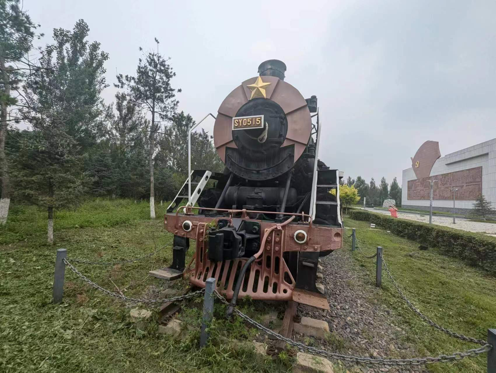
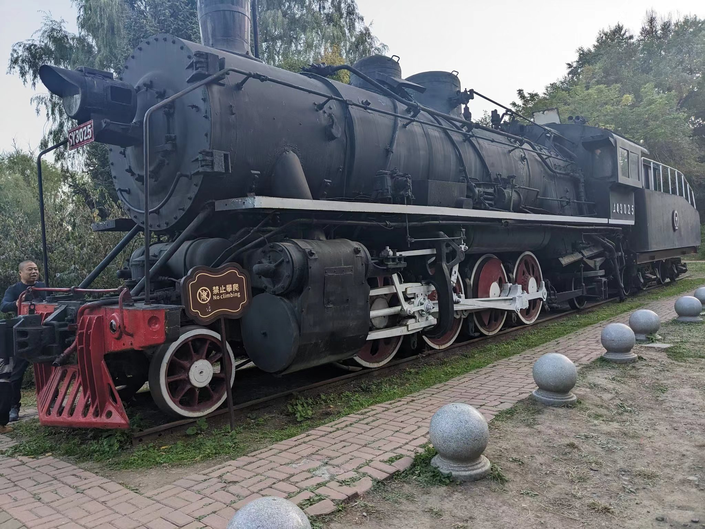
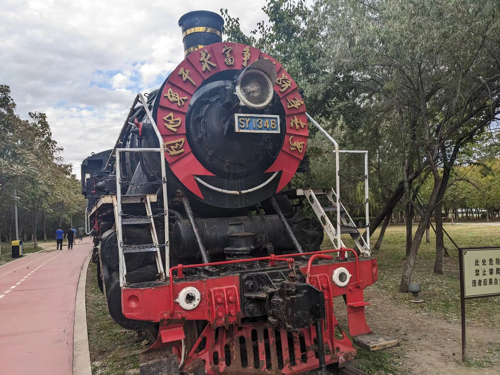

- 上游型0051号机车，曾配属于[大冶铁矿](https://zh.wikipedia.org/wiki/%E5%A4%A7%E5%86%B6%E9%93%81%E7%9F%BF "大冶铁矿")，退役后存放在[湖北省](https://zh.wikipedia.org/wiki/%E6%B9%96%E5%8C%97%E7%9C%81 "湖北省")[黄石市](https://zh.wikipedia.org/wiki/%E9%BB%84%E7%9F%B3%E5%B8%82 "黄石市")[国家矿山公园](https://zh.wikipedia.org/wiki/%E4%B8%AD%E5%8D%8E%E4%BA%BA%E6%B0%91%E5%85%B1%E5%92%8C%E5%9B%BD%E5%9B%BD%E5%AE%B6%E7%9F%BF%E5%B1%B1%E5%85%AC%E5%9B%AD%E5%88%97%E8%A1%A8 "中华人民共和国国家矿山公园列表")，作为展品展出。
- 上游型0053号机车，曾配属于马鞍山钢铁股份有限公司，退役后存放在马钢车轮公司花园广场，作为展品展出。
- 上游型0223号机车（现改编号1029），曾经配属于沈阳铁路局长春机务段，退役后存放在[吉林省](https://zh.wikipedia.org/wiki/%E5%90%89%E6%9E%97%E7%9C%81 "吉林省")[长春市](https://zh.wikipedia.org/wiki/%E9%95%BF%E6%98%A5%E5%B8%82 "长春市")[长春公园](https://zh.wikipedia.org/w/index.php?title=%E9%95%BF%E6%98%A5%E5%85%AC%E5%9B%AD&action=edit&redlink=1 "长春公园（页面不存在）")，作为展品展出。
-  上游型0388号机车，曾配属于云南磷化集团有限公司，退役后存放在[云南铁路博物馆](https://zh.wikipedia.org/wiki/%E4%BA%91%E5%8D%97%E9%93%81%E8%B7%AF%E5%8D%9A%E7%89%A9%E9%A6%86 "云南铁路博物馆")，作为展品展出。
-  上游型0427号机车，唐山机车车辆工厂于1971年9月生产，曾配属[天津钢铁集团](https://zh.wikipedia.org/w/index.php?title=%E5%A4%A9%E6%B4%A5%E9%92%A2%E9%93%81%E9%9B%86%E5%9B%A2&action=edit&redlink=1 "天津钢铁集团（页面不存在）")，退役后存放在[天津市](https://zh.wikipedia.org/wiki/%E5%A4%A9%E6%B4%A5%E5%B8%82 "天津市")[海津大桥](https://zh.wikipedia.org/wiki/%E6%B5%B7%E6%B4%A5%E5%A4%A7%E6%A1%A5 "海津大桥")公园，作为展品展出。
- 上游型0452号机车，退役后曾存放在[黑龙江省](https://zh.wikipedia.org/wiki/%E9%BB%91%E9%BE%99%E6%B1%9F%E7%9C%81 "黑龙江省")[牡丹江火车站](https://zh.wikipedia.org/wiki/%E7%89%A1%E4%B8%B9%E6%B1%9F%E7%AB%99 "牡丹江站")站内，作为展品展出。后移至[哈尔滨火车站](https://zh.wikipedia.org/wiki/%E5%93%88%E5%B0%94%E6%BB%A8%E7%AB%99 "哈尔滨站")展示。
-  ~~上游型0515号机车，曾配属于[吉林省](https://zh.wikipedia.org/wiki/%E5%90%89%E6%9E%97%E7%9C%81 "吉林省")[长春市](https://zh.wikipedia.org/wiki/%E9%95%BF%E6%98%A5%E5%B8%82 "长春市")[九台区](https://zh.wikipedia.org/wiki/%E4%B9%9D%E5%8F%B0%E5%8C%BA "九台区")营城矿业，退役后于2020年起存放于九台区马鞍山村三下江南战役纪念馆，作静态展示。~~

-  上游型0680号机车，曾经配属于沈阳铁路局长春机务段，退役后存放在吉林省[长春市](https://zh.wikipedia.org/wiki/%E9%95%BF%E6%98%A5%E5%B8%82 "长春市")富奥小区，作为展品展出。
- ~~上游型3025号机车，曾经配属于沈阳铁路局长春机务段，退役后存放在吉林省[长春市](https://zh.wikipedia.org/wiki/%E9%95%BF%E6%98%A5%E5%B8%82)南湖公园，作为展品展出。~~

- 上游型3026号机车，曾经配属于沈阳铁路局长春机务段，退役后存放在吉林省[长春市](https://zh.wikipedia.org/wiki/%E9%95%BF%E6%98%A5%E5%B8%82 "长春市")[胜利公园](https://zh.wikipedia.org/wiki/%E8%83%9C%E5%88%A9%E5%85%AC%E5%9B%AD "胜利公园")，作为展品展出。
- ~~上游 1346~~
