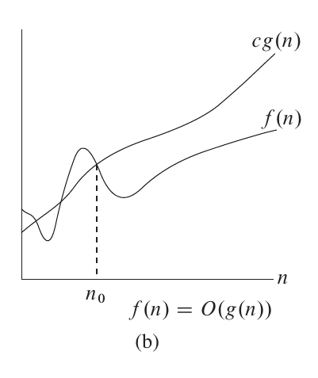

>在设计算法时，我们需要关心这个算法的性能如何。这时就需要分析它的时间复杂度和空间复杂度。时间复杂度反映算法随着输入规模的增加其所需要的时间如何变化，空间复杂度反映算法调用的资源随输入规模的增加如何变化。

## 引入：
“算法用时随输入规模的变化趋势”显然是一个抽象的概念，于是我们采用了不同的**函数渐进符号**来描述这种趋势。大 o 记号就是其中一种。

通常情况下，我们要粗略地估计一个算法用时所能达到的最大值。大 o 记号为我们提供了**算法用时随输入规模变化的趋势所能达到的上界**。

## 定义：
$$
设函数f(x)，g(x)。我们记f(x)=o(g(x)).$$
$$当且仅当\exists n_0,c，使得\forall n>n_0,0\leq f(x) \leq cg(x)
$$

## 使用：
我们通常指关系使得 $f (n)$ 变化最剧烈的那部分。

如：当**一个算法所造成的代价为 $n^2+n+1$** ，那么我们认为它的时间复杂度为 $o (n^2)$ .

```cpp
int n,m;
scanf("%d %d",&n,&m);
for(int i=0;i<n;i++){
	for(int i=0;i<n;i++){
	   for(int i=0;i<m;i++)
	      printf("hello,world!");
	}
}
```
这段代码的时间复杂度为 $o (n^2 m)$ .

- 我们通常只关心对整个算法时间影响最大的部分。
- 
```csharp
public int cal(int n)
{
    int sum_1 = 0;
    int p = 1;
    for (; p < 100; ++p)
    {
        sum_1 = sum_1 + p;
    }

    int sum_2 = 0;
    int q = 1;
    for (; q < n; ++q)
    {
        sum_2 = sum_2 + q;
    }

    int sum_3 = 0;
    int i = 1;
    int j = 1;
    for (; i <= n; ++i)
    {
        j = 1;
        for (; j <= n; ++j)
        {
            sum_3 = sum_3 + i * j;
        }
    }

    return sum_1 + sum_2 + sum_3;
}


`````````

这个算法的时间复杂度是 $o (n^2)$.

